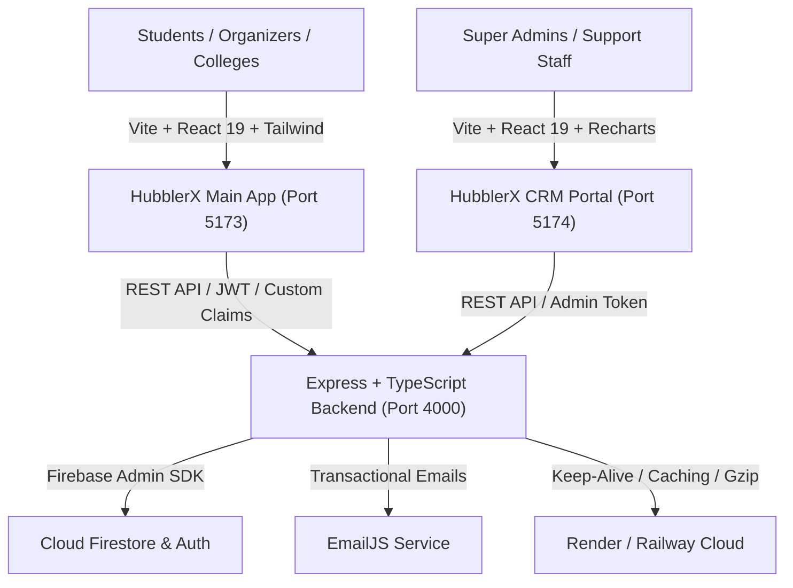
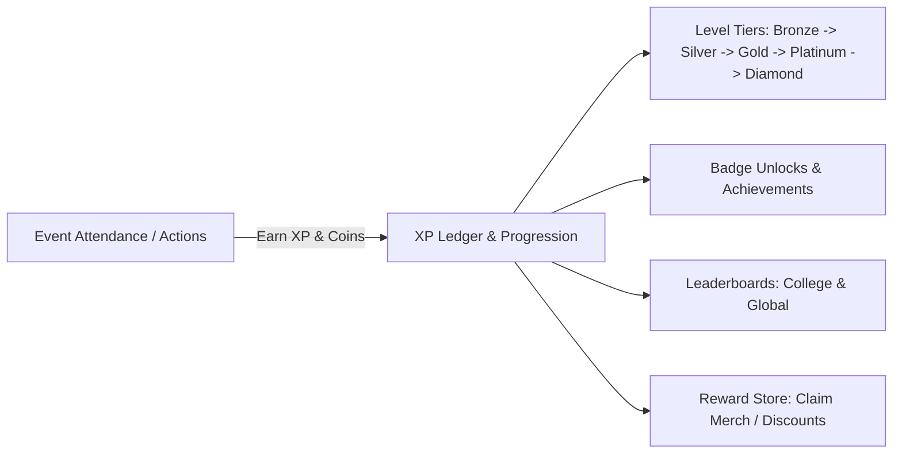

# 📋 HubblerX — Centralized Project Changelog & Task Tracker

> **A comprehensive, centralized record of all features, architecture milestones, commits, bug fixes, performance optimizations, and task tracking throughout the development of HubblerX.**

---

## 📌 Table of Contents

1. [Project Overview & Architecture](#-project-overview--architecture)
2. [Major Milestone Timeline](#-major-milestone-timeline)
3. [Chronological Change & Commit History](#-chronological-change--commit-history)
4. [Component & Feature Architecture Matrix](#-component--feature-architecture-matrix)
   - [1. Main Application (`hubblers/`)](#1-main-application-hubblers)
   - [2. Admin CRM Dashboard (`crm/`)](#2-admin-crm-dashboard-crm)
   - [3. Backend REST API & Services (`hubblers/server/`)](#3-backend-rest-api--services-hubblersserver)
   - [4. Rewards & Gamification Engine](#4-rewards--gamification-engine)
   - [5. Networking, Community & Connections](#5-networking-community--connections)
   - [6. Email & Notification System](#6-email--notification-system)
   - [7. Security, Auth & Access Control](#7-security-auth--access-control)
5. [Resolved Issues & Technical Fixes](#-resolved-issues--technical-fixes)
6. [Deployment & DevOps Tracking](#-deployment--devops-tracking)
7. [Completed Tasks vs. Roadmap Tracking](#-completed-tasks-vs-roadmap-tracking)
8. [File Structure & Module Directory](#-file-structure--module-directory)

---

## 🏛️ Project Overview & Architecture

**HubblerX** is a full-stack student-college engagement and networking platform connecting students, college administrators, event organizers, and platform administrators through role-based access, event registration, QR ticketing, gamification (XP/levels/rewards), social networking, and a dedicated admin CRM dashboard.

### Core Architecture Pillars



---

## 🚀 Major Milestone Timeline

| Milestone | Date | Key Deliverables | Status |
|---|---|---|---|
| **M1: Core Workspace & MVP** | 2026-08-22 | Multi-role auth, Event creation & browsing, QR ticketing, EmailJS integration, Firestore setup | ✅ Completed |
| **M2: Admin CRM Dashboard** | 2026-08-22 | Standalone CRM app, Platform KPI overview, User/Organizer management, Activity auditing | ✅ Completed |
| **M3: Gamification & Rewards** | 2026-08-23 | XP/Coin ledger, Level tiers, Badge achievements, Reward Store, Certificates, Referrals | ✅ Completed |
| **M4: Social Networking & Feed** | 2026-08-23 | Unique Hubbler IDs, Friend/Peer connections, Achievement posts, Public user profiles | ✅ Completed |
| **M5: Code Quality & Strict Typing** | 2026-08-24 | Zero ESLint errors across 3 apps, strict TypeScript literal types, root npm orchestration | ✅ Completed |
| **M6: UI/UX & Theme Overhaul** | 2026-08-30 | Sleek monochrome Dark CRM theme, UserProfileTab redesign, structured responsive navbar | ✅ Completed |
| **M7: Performance & Deployment** | 2026-08-30 | React lazy-loading, Gzip compression, static asset caching, Render keep-alive, Railway deploy | ✅ Completed |

---

## 📜 Chronological Change & Commit History

### 1. `d34fb0e` — Initial Workspace Setup, Core App, CRM & Event Creation
- **Date**: 2026-08-22
- **Author**: dhanush2k06
- **Summary**: Full workspace bootstrap including the main client (`hubblers/`), standalone CRM dashboard (`crm/`), and backend API (`hubblers/server/`).
- **Key Deliverables**:
  - **Backend REST API**: Implemented Express TypeScript server with routes for [auth.ts](file:///c:/Users/dhanu/OneDrive/Desktop/Project%20-%20HubblerX/hubblers/server/src/routes/auth.ts), [events.ts](file:///c:/Users/dhanu/OneDrive/Desktop/Project%20-%20HubblerX/hubblers/server/src/routes/events.ts), [colleges.ts](file:///c:/Users/dhanu/OneDrive/Desktop/Project%20-%20HubblerX/hubblers/server/src/routes/colleges.ts), [dashboard.ts](file:///c:/Users/dhanu/OneDrive/Desktop/Project%20-%20HubblerX/hubblers/server/src/routes/dashboard.ts), [users.ts](file:///c:/Users/dhanu/OneDrive/Desktop/Project%20-%20HubblerX/hubblers/server/src/routes/users.ts), and [crm.ts](file:///c:/Users/dhanu/OneDrive/Desktop/Project%20-%20HubblerX/hubblers/server/src/routes/crm.ts).
  - **Auth & Roles**: Configured Firebase Authentication with role-based middleware (`STUDENT`, `COLLEGE_ADMIN`, `ORGANIZER`, `ADMIN`, `SUPPORT`).
  - **Event Management**: Built event listing, detail view, organizer event creation form, participant registrations, and QR code ticket generation ([qr.ts](file:///c:/Users/dhanu/OneDrive/Desktop/Project%20-%20HubblerX/hubblers/server/src/utils/qr.ts)).
  - **Main Frontend Pages**: Added [HomePage.tsx](file:///c:/Users/dhanu/OneDrive/Desktop/Project%20-%20HubblerX/hubblers/src/pages/HomePage.tsx), [EventsPage.tsx](file:///c:/Users/dhanu/OneDrive/Desktop/Project%20-%20HubblerX/hubblers/src/pages/EventsPage.tsx), [DashboardPage.tsx](file:///c:/Users/dhanu/OneDrive/Desktop/Project%20-%20HubblerX/hubblers/src/pages/DashboardPage.tsx), [LoginPage.tsx](file:///c:/Users/dhanu/OneDrive/Desktop/Project%20-%20HubblerX/hubblers/src/pages/LoginPage.tsx), [StudentSignupPage.tsx](file:///c:/Users/dhanu/OneDrive/Desktop/Project%20-%20HubblerX/hubblers/src/pages/StudentSignupPage.tsx), [OrganizerSignupPage.tsx](file:///c:/Users/dhanu/OneDrive/Desktop/Project%20-%20HubblerX/hubblers/src/pages/OrganizerSignupPage.tsx), [AboutPage.tsx](file:///c:/Users/dhanu/OneDrive/Desktop/Project%20-%20HubblerX/hubblers/src/pages/AboutPage.tsx), [ContactPage.tsx](file:///c:/Users/dhanu/OneDrive/Desktop/Project%20-%20HubblerX/hubblers/src/pages/ContactPage.tsx).
  - **Standalone CRM App**: Created [OverviewPage.tsx](file:///c:/Users/dhanu/OneDrive/Desktop/Project%20-%20HubblerX/crm/src/pages/OverviewPage.tsx), [StudentsPage.tsx](file:///c:/Users/dhanu/OneDrive/Desktop/Project%20-%20HubblerX/crm/src/pages/StudentsPage.tsx), [OrganizersPage.tsx](file:///c:/Users/dhanu/OneDrive/Desktop/Project%20-%20HubblerX/crm/src/pages/OrganizersPage.tsx), [EventsPage.tsx](file:///c:/Users/dhanu/OneDrive/Desktop/Project%20-%20HubblerX/crm/src/pages/EventsPage.tsx), [ActivityPage.tsx](file:///c:/Users/dhanu/OneDrive/Desktop/Project%20-%20HubblerX/crm/src/pages/ActivityPage.tsx), [UserDetailPage.tsx](file:///c:/Users/dhanu/OneDrive/Desktop/Project%20-%20HubblerX/crm/src/pages/UserDetailPage.tsx).

---

### 2. `2164157` — Files Updated
- **Date**: 2026-08-22
- **Author**: dhanush2k06
- **Summary**: Incremental updates and sync across client assets, services, and route helpers.

---

### 3. `e5f03fb` — Workspace Setup, Documentation, Licensing & Security Protection
- **Date**: 2026-08-23
- **Author**: dhanush2k06
- **Summary**: Comprehensive workspace hardening, project documentation, license files, email notification workflows, and report handling.
- **Key Deliverables**:
  - **Documentation**: Added [README.md](file:///c:/Users/dhanu/OneDrive/Desktop/Project%20-%20HubblerX/README.md), [RUN_CRM.md](file:///c:/Users/dhanu/OneDrive/Desktop/Project%20-%20HubblerX/RUN_CRM.md), [LICENSE.md](file:///c:/Users/dhanu/OneDrive/Desktop/Project%20-%20HubblerX/LICENSE.md), and [emailjs-templates.md](file:///c:/Users/dhanu/OneDrive/Desktop/Project%20-%20HubblerX/emailjs-templates.md).
  - **Email Service**: Expanded [emailService.ts](file:///c:/Users/dhanu/OneDrive/Desktop/Project%20-%20HubblerX/hubblers/server/src/services/emailService.ts) with templates for welcome emails, event registration confirmations, QR ticket emails, and college approval notifications.
  - **Excel Export**: Built [excelExport.ts](file:///c:/Users/dhanu/OneDrive/Desktop/Project%20-%20HubblerX/hubblers/src/utils/excelExport.ts) for exporting event attendee lists directly to Excel/CSV.
  - **Admin Seeding**: Automated initial super-admin user creation via [seedAdmin.ts](file:///c:/Users/dhanu/OneDrive/Desktop/Project%20-%20HubblerX/hubblers/server/src/seedAdmin.ts).

---

### 4. `a5ccbba` & `9022e88` — Render Blueprint Deployment
- **Date**: 2026-08-23
- **Author**: dhanush2k06
- **Summary**: Multi-service automated deployment blueprint for Render.com via [render.yaml](file:///c:/Users/dhanu/OneDrive/Desktop/Project%20-%20HubblerX/render.yaml).
- **Key Deliverables**:
  - Configured 3 services on Render: Backend Web Service (`hubblerx-api`), Main App Static Site (`hubblerx-client`), and CRM Static Site (`hubblerx-crm`).
  - Fixed blueprint schema by removing deprecated `plan` field from static site configurations.

---

### 5. `3cac452`, `1c75487`, `13a1aee` — Server Security, CORS & Env Resiliency
- **Date**: 2026-08-23
- **Author**: dhanush2k06
- **Summary**: Cloud deployment stability fixes for Firebase Admin credentials, Helmet headers, and wildcard CORS.
- **Key Deliverables**:
  - **Env Validation**: Aggregated missing environment variables into a single informative startup error message ([config.ts](file:///c:/Users/dhanu/OneDrive/Desktop/Project%20-%20HubblerX/hubblers/server/src/config.ts)).
  - **Private Key Normalization**: Handled escaped `\n` newlines in `FIREBASE_PRIVATE_KEY` across Render/Railway environment injections.
  - **Cross-Origin & Helmet**: Configured Helmet Cross-Origin Resource Policy (CORP) to `cross-origin` and enabled automatic CORS for `*.onrender.com` subdomains.

---

### 6. `1c18126` — Reward & Gamification System + Networking & Community Feed
- **Date**: 2026-08-23
- **Author**: dhanush2k06
- **Summary**: Massive feature expansion adding complete gamification mechanics, social networking, achievement feed, and rewards administration.
- **Key Deliverables**:
  - **Gamification Engine**:
    - Built [rewardConfig.ts](file:///c:/Users/dhanu/OneDrive/Desktop/Project%20-%20HubblerX/hubblers/server/src/rewardConfig.ts) & [rewardService.ts](file:///c:/Users/dhanu/OneDrive/Desktop/Project%20-%20HubblerX/hubblers/server/src/services/rewardService.ts) for XP calculation, leveling tiers (Bronze → Diamond), badges, daily streaks, coin ledger, and redemption validation.
    - Added frontend reward components: [XPLevelCard.tsx](file:///c:/Users/dhanu/OneDrive/Desktop/Project%20-%20HubblerX/hubblers/src/components/rewards/XPLevelCard.tsx), [RewardStore.tsx](file:///c:/Users/dhanu/OneDrive/Desktop/Project%20-%20HubblerX/hubblers/src/components/rewards/RewardStore.tsx), [BadgeGallery.tsx](file:///c:/Users/dhanu/OneDrive/Desktop/Project%20-%20HubblerX/hubblers/src/components/rewards/BadgeGallery.tsx), [LeaderboardView.tsx](file:///c:/Users/dhanu/OneDrive/Desktop/Project%20-%20HubblerX/hubblers/src/components/rewards/LeaderboardView.tsx), [CertificateSection.tsx](file:///c:/Users/dhanu/OneDrive/Desktop/Project%20-%20HubblerX/hubblers/src/components/rewards/CertificateSection.tsx), [ReferralModal.tsx](file:///c:/Users/dhanu/OneDrive/Desktop/Project%20-%20HubblerX/hubblers/src/components/rewards/ReferralModal.tsx), [FeedbackModal.tsx](file:///c:/Users/dhanu/OneDrive/Desktop/Project%20-%20HubblerX/hubblers/src/components/rewards/FeedbackModal.tsx), [RedemptionHistory.tsx](file:///c:/Users/dhanu/OneDrive/Desktop/Project%20-%20HubblerX/hubblers/src/components/rewards/RedemptionHistory.tsx).
    - CRM Rewards Admin: [RewardsManagementPage.tsx](file:///c:/Users/dhanu/OneDrive/Desktop/Project%20-%20HubblerX/crm/src/pages/RewardsManagementPage.tsx) to manage reward items, approve/reject redemptions, and inspect XP logs.
  - **Social Networking & Community**:
    - Built unique Hubbler ID generation ([hubblerId.ts](file:///c:/Users/dhanu/OneDrive/Desktop/Project%20-%20HubblerX/hubblers/server/src/utils/hubblerId.ts)).
    - Implemented [connectionService.ts](file:///c:/Users/dhanu/OneDrive/Desktop/Project%20-%20HubblerX/hubblers/server/src/services/connectionService.ts) & [connections.ts](file:///c:/Users/dhanu/OneDrive/Desktop/Project%20-%20HubblerX/hubblers/server/src/routes/connections.ts) for sending, accepting, and managing peer connections.
    - Community Feed: [postService.ts](file:///c:/Users/dhanu/OneDrive/Desktop/Project%20-%20HubblerX/hubblers/server/src/services/postService.ts) & [posts.ts](file:///c:/Users/dhanu/OneDrive/Desktop/Project%20-%20HubblerX/hubblers/server/src/routes/posts.ts) for sharing achievement posts, milestones, and event highlights with likes/comments.
    - Frontend networking components: [ConnectionsHub.tsx](file:///c:/Users/dhanu/OneDrive/Desktop/Project%20-%20HubblerX/hubblers/src/components/connections/ConnectionsHub.tsx), [PublicProfileModal.tsx](file:///c:/Users/dhanu/OneDrive/Desktop/Project%20-%20HubblerX/hubblers/src/components/connections/PublicProfileModal.tsx), [CommunityFeed.tsx](file:///c:/Users/dhanu/OneDrive/Desktop/Project%20-%20HubblerX/hubblers/src/components/feed/CommunityFeed.tsx), and [PublicProfilePage.tsx](file:///c:/Users/dhanu/OneDrive/Desktop/Project%20-%20HubblerX/hubblers/src/pages/PublicProfilePage.tsx).

---

### 7. `7ad03b4`, `6f5e296`, `ebbed1a`, `89d019e` — Code Quality, Strict Typing & Build Agnosticism
- **Date**: 2026-08-24
- **Author**: dhanush2k06
- **Summary**: Comprehensive codebase refactoring to achieve 0 ESLint and 0 TypeScript errors across all 3 sub-projects, along with monorepo build scripts.
- **Key Deliverables**:
  - **ESLint Clean Slate**: Standardized flat config ([eslint.config.js](file:///c:/Users/dhanu/OneDrive/Desktop/Project%20-%20HubblerX/hubblers/eslint.config.js) and [crm/eslint.config.js](file:///c:/Users/dhanu/OneDrive/Desktop/Project%20-%20HubblerX/crm/eslint.config.js)), allowed unused `_` prefixed parameters, and resolved all hook dependency warnings.
  - **Strict Literal Types**: Enforced exact literal status types (`'pending' | 'accepted' | 'rejected'`) in connection service.
  - **Monorepo Root Delegation**: Created root [package.json](file:///c:/Users/dhanu/OneDrive/Desktop/Project%20-%20HubblerX/package.json) with unified scripts: `build:backend`, `build:frontend`, `build:crm`, `build:all`, allowing directory-agnostic builds on cloud providers.

---

### 8. `52a51bf` & `3e550b4` — Theme Overhaul, Profile Tab & Railway Deployment
- **Date**: 2026-08-30
- **Author**: dhanush2k06
- **Summary**: Sleek monochrome dark redesign for the CRM dashboard, dedicated User Profile Tab, modernized Navigation bar, and Railway configuration.
- **Key Deliverables**:
  - **Black & White Sleek CRM Theme**: Re-skinned CRM [Layout.tsx](file:///c:/Users/dhanu/OneDrive/Desktop/Project%20-%20HubblerX/crm/src/components/Layout.tsx), [OverviewPage.tsx](file:///c:/Users/dhanu/OneDrive/Desktop/Project%20-%20HubblerX/crm/src/pages/OverviewPage.tsx), [ReportsPage.tsx](file:///c:/Users/dhanu/OneDrive/Desktop/Project%20-%20HubblerX/crm/src/pages/ReportsPage.tsx), and [OrganizerDetailPage.tsx](file:///c:/Users/dhanu/OneDrive/Desktop/Project%20-%20HubblerX/crm/src/pages/OrganizerDetailPage.tsx) with a premium monochrome dark UI.
  - **User Profile Management**: Created [UserProfileTab.tsx](file:///c:/Users/dhanu/OneDrive/Desktop/Project%20-%20HubblerX/hubblers/src/components/profile/UserProfileTab.tsx) for students to manage profile information, bio, social links, college details, and avatars.
  - **Navbar Refactor**: Enhanced [Navbar.tsx](file:///c:/Users/dhanu/OneDrive/Desktop/Project%20-%20HubblerX/hubblers/src/components/Navbar.tsx) with active tab indicators, mobile hamburger dropdown, and role-based action buttons.
  - **Railway Deployment**: Added root [railway.json](file:///c:/Users/dhanu/OneDrive/Desktop/Project%20-%20HubblerX/railway.json), [hubblers/server/railway.json](file:///c:/Users/dhanu/OneDrive/Desktop/Project%20-%20HubblerX/hubblers/server/railway.json), [Procfile](file:///c:/Users/dhanu/OneDrive/Desktop/Project%20-%20HubblerX/Procfile), and [RAILWAY_DEPLOYMENT.md](file:///c:/Users/dhanu/OneDrive/Desktop/Project%20-%20HubblerX/RAILWAY_DEPLOYMENT.md).

---

### 9. `788cba4` — Performance Optimization & Lazy Code-Splitting
- **Date**: 2026-08-30
- **Author**: dhanush2k06
- **Summary**: Full-stack performance tuning across both React frontends and the Express backend.
- **Key Deliverables**:
  - **React Lazy Code Splitting**: Converted heavy page components in [App.tsx](file:///c:/Users/dhanu/OneDrive/Desktop/Project%20-%20HubblerX/hubblers/src/App.tsx) and [crm/src/App.tsx](file:///c:/Users/dhanu/OneDrive/Desktop/Project%20-%20HubblerX/crm/src/App.tsx) to `React.lazy()` with fallback spinner components, drastically reducing initial JS bundle size.
  - **Vite Rollup Chunking**: Configured manual vendor chunk splitting in [vite.config.ts](file:///c:/Users/dhanu/OneDrive/Desktop/Project%20-%20HubblerX/hubblers/vite.config.ts) and [crm/vite.config.ts](file:///c:/Users/dhanu/OneDrive/Desktop/Project%20-%20HubblerX/crm/vite.config.ts) (`vendor-react`, `vendor-firebase`, `vendor-recharts`, `vendor-icons`).
  - **Express Gzip Compression & Static Caching**: Added `compression()` middleware and `maxAge: '1y'` caching headers for static assets.
  - **Render Keep-Alive Cron**: Implemented an automated background ping timer on the Express server to prevent free-tier Render instances from idling.

---

## 🧩 Component & Feature Architecture Matrix

### 1. Main Application (`hubblers/`)

| File / Component | Responsibility & Features |
|---|---|
| [App.tsx](file:///c:/Users/dhanu/OneDrive/Desktop/Project%20-%20HubblerX/hubblers/src/App.tsx) | Client router, lazy route definitions, authentication state hydration, and layout wrappers |
| [Navbar.tsx](file:///c:/Users/dhanu/OneDrive/Desktop/Project%20-%20HubblerX/hubblers/src/components/Navbar.tsx) | Global top navigation with role badges, notifications, user avatar dropdown, and mobile menu |
| [Sidebar.tsx](file:///c:/Users/dhanu/OneDrive/Desktop/Project%20-%20HubblerX/hubblers/src/components/Sidebar.tsx) | Collapsible dashboard navigation sidebar with tab switching |
| [HomePage.tsx](file:///c:/Users/dhanu/OneDrive/Desktop/Project%20-%20HubblerX/hubblers/src/pages/HomePage.tsx) | Landing page with hero banner, feature showcases, call-to-actions, and stats |
| [EventsPage.tsx](file:///c:/Users/dhanu/OneDrive/Desktop/Project%20-%20HubblerX/hubblers/src/pages/EventsPage.tsx) | Interactive event catalog with category filtering, search, date filters, and registration modals |
| [DashboardPage.tsx](file:///c:/Users/dhanu/OneDrive/Desktop/Project%20-%20HubblerX/hubblers/src/pages/DashboardPage.tsx) | Central hub with role-specific views (Student, College Admin, Organizer) and tabbed interfaces |
| [UserProfileTab.tsx](file:///c:/Users/dhanu/OneDrive/Desktop/Project%20-%20HubblerX/hubblers/src/components/profile/UserProfileTab.tsx) | Profile editing, avatar upload, academic details, bio, and social handles |
| [PublicProfilePage.tsx](file:///c:/Users/dhanu/OneDrive/Desktop/Project%20-%20HubblerX/hubblers/src/pages/PublicProfilePage.tsx) | Shareable public user profile displaying badges, stats, events attended, and connect button |
| [ConnectionsHub.tsx](file:///c:/Users/dhanu/OneDrive/Desktop/Project%20-%20HubblerX/hubblers/src/components/connections/ConnectionsHub.tsx) | Peer discovery, friend requests, connection list, and search by Hubbler ID |
| [CommunityFeed.tsx](file:///c:/Users/dhanu/OneDrive/Desktop/Project%20-%20HubblerX/hubblers/src/components/feed/CommunityFeed.tsx) | Feed of achievements, event participation, user posts, likes, and comments |

---

### 2. Admin CRM Dashboard (`crm/`)

| File / Component | Responsibility & Features |
|---|---|
| [Layout.tsx](file:///c:/Users/dhanu/OneDrive/Desktop/Project%20-%20HubblerX/crm/src/components/Layout.tsx) | Monochrome dark CRM shell, admin header, quick stats, sidebar navigation, and auth guard |
| [OverviewPage.tsx](file:///c:/Users/dhanu/OneDrive/Desktop/Project%20-%20HubblerX/crm/src/pages/OverviewPage.tsx) | Platform KPIs, Recharts data visualizations (User distribution donut, 7-day activity area chart, top colleges bar chart) |
| [StudentsPage.tsx](file:///c:/Users/dhanu/OneDrive/Desktop/Project%20-%20HubblerX/crm/src/pages/StudentsPage.tsx) | Filterable student directory with XP stats, connection count, and detail drawer |
| [OrganizersPage.tsx](file:///c:/Users/dhanu/OneDrive/Desktop/Project%20-%20HubblerX/crm/src/pages/OrganizersPage.tsx) | College & club organizer directory with verification workflow (Approve / Reject) |
| [OrganizerDetailPage.tsx](file:///c:/Users/dhanu/OneDrive/Desktop/Project%20-%20HubblerX/crm/src/pages/OrganizerDetailPage.tsx) | In-depth organizer verification inspection, document review, and status updates |
| [RewardsManagementPage.tsx](file:///c:/Users/dhanu/OneDrive/Desktop/Project%20-%20HubblerX/crm/src/pages/RewardsManagementPage.tsx) | Catalog management (add/edit items, stock levels), redemption approval queue, and XP logs |
| [ReportsPage.tsx](file:///c:/Users/dhanu/OneDrive/Desktop/Project%20-%20HubblerX/crm/src/pages/ReportsPage.tsx) | Flagged content moderation (spam, scam, fake events), report resolution, and user suspension |
| [ActivityPage.tsx](file:///c:/Users/dhanu/OneDrive/Desktop/Project%20-%20HubblerX/crm/src/pages/ActivityPage.tsx) | Real-time audit trail of all platform events (signups, logins, registrations, redemptions) |

---

### 3. Backend REST API & Services (`hubblers/server/`)

| Route / Service | Endpoint Path / Duty | Responsibility |
|---|---|---|
| [auth.ts](file:///c:/Users/dhanu/OneDrive/Desktop/Project%20-%20HubblerX/hubblers/server/src/routes/auth.ts) | `/api/auth/*` | Signup, login token exchange, user role verification, and session check |
| [events.ts](file:///c:/Users/dhanu/OneDrive/Desktop/Project%20-%20HubblerX/hubblers/server/src/routes/events.ts) | `/api/events/*` | Event CRUD, registration, QR ticket generation, attendee check-in, and Excel exports |
| [colleges.ts](file:///c:/Users/dhanu/OneDrive/Desktop/Project%20-%20HubblerX/hubblers/server/src/routes/colleges.ts) | `/api/colleges/*` | College registration, verification workflow, and institution analytics |
| [rewards.ts](file:///c:/Users/dhanu/OneDrive/Desktop/Project%20-%20HubblerX/hubblers/server/src/routes/rewards.ts) | `/api/rewards/*` | Reward store catalog, coin redemption, leaderboard rankings, badge claims, and referrals |
| [connections.ts](file:///c:/Users/dhanu/OneDrive/Desktop/Project%20-%20HubblerX/hubblers/server/src/routes/connections.ts) | `/api/connections/*` | Connection requests, accepts, rejects, disconnects, and peer discovery |
| [posts.ts](file:///c:/Users/dhanu/OneDrive/Desktop/Project%20-%20HubblerX/hubblers/server/src/routes/posts.ts) | `/api/posts/*` | Create achievement posts, fetch community feed, toggle likes, add comments |
| [crm.ts](file:///c:/Users/dhanu/OneDrive/Desktop/Project%20-%20HubblerX/hubblers/server/src/routes/crm.ts) | `/api/crm/*` | Admin-only KPI aggregation, user moderation, report resolutions, and catalog controls |
| [rewardService.ts](file:///c:/Users/dhanu/OneDrive/Desktop/Project%20-%20HubblerX/hubblers/server/src/services/rewardService.ts) | Business Logic | XP calculation, level progression, badge verification, and atomic Firestore transactions |
| [connectionService.ts](file:///c:/Users/dhanu/OneDrive/Desktop/Project%20-%20HubblerX/hubblers/server/src/services/connectionService.ts) | Business Logic | Bi-directional friendship graph, Hubbler ID lookups, and connection status queries |
| [emailService.ts](file:///c:/Users/dhanu/OneDrive/Desktop/Project%20-%20HubblerX/hubblers/server/src/services/emailService.ts) | Transactional Emails | EmailJS integration for welcome, QR tickets, certificates, and alerts |
| [activityLogger.ts](file:///c:/Users/dhanu/OneDrive/Desktop/Project%20-%20HubblerX/hubblers/server/src/services/activityLogger.ts) | Auditing | Centralized asynchronous event logging into the `activityLogs` Firestore collection |

---

### 4. Rewards & Gamification Engine



- **XP / Coins Breakdown**:
  - Event Registration: `+20 XP`
  - Event Attendance / QR Scan: `+100 XP` & `+50 Hubbler Coins`
  - Profile Completion: `+50 XP`
  - Peer Connection Formed: `+15 XP`
  - Referral Signed Up: `+150 XP` & `+75 Coins`
- **Tiers**: Bronze (0 XP) ➔ Silver (500 XP) ➔ Gold (1,500 XP) ➔ Platinum (3,500 XP) ➔ Diamond (7,000+ XP).

---

### 5. Networking, Community & Connections

- **Hubbler ID**: Unique, short-code identifier (e.g. `HUB-8X92K`) generated for every registered student for frictionless connection sharing.
- **Connection Graph**: Dual-sided request & acceptance state machine (`none` ➔ `pending_sent` / `pending_received` ➔ `connected`).
- **Community Feed**: Public feed highlighting student milestones, event participations, certificates earned, and custom posts.

---

### 6. Email & Notification System

- Transactional emails powered by **EmailJS** with HTML templates:
  1. **Welcome Email**: Sent upon student or organizer onboarding.
  2. **Event Registration & QR Ticket**: Contains event details, date, location, and embedded QR code ticket.
  3. **College Approval / Rejection Notification**: Alerts college admins of verification status.
  4. **Certificate Notification**: Delivers participation certificates.

---

### 7. Security, Auth & Access Control

- **Firebase Authentication**: Custom claims stamped on user tokens (`role: 'STUDENT' | 'ORGANIZER' | 'COLLEGE_ADMIN' | 'ADMIN' | 'SUPPORT'`).
- **Middleware Guards**:
  - `authenticateUser`: Validates Firebase ID tokens, decodes claims, verifies user existence in Firestore.
  - `authorizeRoles`: Restricts endpoints to authorized roles (e.g. `/api/crm/*` strictly requires `ADMIN` or `SUPPORT`).
- **Firestore Security Rules**: Collection-level read/write permissions matching user roles and ownership.
- **API Defense**: `helmet` headers, rate limiting on sensitive routes, and sanitized CORS policies.

---

## 🛠️ Resolved Issues & Technical Fixes

| Issue / Bug | Root Cause | Resolution | Commit |
|---|---|---|---|
| **CRM Login 404** | Client proxy port mismatch between 5173 and 5174 | Corrected Vite API proxy and relative URL mappings | `d34fb0e` |
| **Firestore Composite Index Error** | Multi-field query on `activityLogs` (userId + timestamp) required composite index | Refactored query to use single-field indexing with memory sorting | `d34fb0e` |
| **Missing Env Crash on Render** | Partial env vars threw individual runtime exceptions | Aggregated missing variables into a single startup check with clear diagnostic messages | `3cac452` |
| **Private Key `\n` Parsing** | Cloud hosting injected `\n` as literal string characters rather than newlines | Added regex normalization `.replace(/\\n/g, '\n')` in Firebase Admin config | `1c75487` |
| **CORP / CORS Blocks** | Helmet default strict CORP blocked cross-origin assets across subdomains | Configured Helmet `crossOriginResourcePolicy({ policy: "cross-origin" })` and wildcards | `13a1aee` |
| **Render Blueprint Error** | Deprecated `plan` key in static site configuration in `render.yaml` | Removed `plan` field from static site blocks in blueprint | `9022e88` |
| **Render Monorepo Build Failure** | Render looked for `package.json` at root instead of subdirectories | Created root `package.json` with delegate scripts and directory-agnostic commands | `6f5e296`, `89d019e` |
| **ESLint Warnings & Lint Failure** | `react-hooks/set-state-in-effect` and unused variable warnings | Configured flat ESLint configs, added `_` prefix ignore rules, and cleaned up async states | `7ad03b4` |
| **TypeScript Literal Type Mismatch** | Generic string cast on connection status caused strict TS compile error | Enforced literal union types `'pending' \| 'accepted' \| 'rejected'` in connection service | `ebbed1a` |
| **Render Free Tier Idling** | Backend spun down after 15 minutes of inactivity | Added automatic self-ping keep-alive service running every 14 minutes | `788cba4` |
| **Large Initial JS Bundle** | All pages loaded in single entry point | Implemented `React.lazy()` dynamic imports with vendor chunk splitting in Vite | `788cba4` |

---

## 🌐 Deployment & DevOps Tracking

### Deployment Channels

1. **Render.com** (Multi-Service Blueprint):
   - Blueprint configuration: [render.yaml](file:///c:/Users/dhanu/OneDrive/Desktop/Project%20-%20HubblerX/render.yaml)
   - Backend Web Service: `hubblerx-api` (`npm run build:backend` ➔ `node dist-server/index.js`)
   - Main App Static Site: `hubblerx-client` (`npm run build:frontend` ➔ `hubblers/dist`)
   - CRM Portal Static Site: `hubblerx-crm` (`npm run build:crm` ➔ `crm/dist`)

2. **Railway.app**:
   - Deployment configuration: [railway.json](file:///c:/Users/dhanu/OneDrive/Desktop/Project%20-%20HubblerX/railway.json), [Procfile](file:///c:/Users/dhanu/OneDrive/Desktop/Project%20-%20HubblerX/Procfile)
   - Guide: [RAILWAY_DEPLOYMENT.md](file:///c:/Users/dhanu/OneDrive/Desktop/Project%20-%20HubblerX/RAILWAY_DEPLOYMENT.md)

---

## 📊 Completed Tasks vs. Roadmap Tracking

### Completed Tasks
- [x] Multi-role Firebase Authentication (Email/Password & Google OAuth)
- [x] Role-Based Access Control (RBAC) with Firebase Custom Claims
- [x] Full Event Lifecycle (Creation, Editing, Publishing, Browsing, Filtering)
- [x] Ticket Generation with dynamic QR Codes
- [x] Attendance Tracking & Excel Attendee Exports
- [x] Gamified Rewards System (XP, Coins, Badges, Level Tiers, Leaderboards)
- [x] Reward Store & Admin Redemption Queue
- [x] Social Networking Engine (Unique Hubbler IDs, Friend Requests, Connections)
- [x] Community Activity Feed with Likes & Comments
- [x] Public User Profiles with Badges & Event Showcase
- [x] Student Profile Management (Bio, Socials, College Info)
- [x] Dedicated Admin CRM Dashboard (Black & White Dark Mode)
- [x] Interactive Platform Analytics with Recharts
- [x] Platform Content Moderation & Reports System
- [x] Comprehensive Activity Audit Logging
- [x] Transactional Email Workflows (EmailJS)
- [x] Performance Optimizations (Lazy Loading, Gzip, Asset Caching, Keep-Alive)
- [x] Multi-Cloud Deployment Blueprints (Render & Railway)
- [x] Zero Linting & Zero TypeScript Errors

### Future Roadmap & Enhancements
- [ ] Push Notifications for event reminders & connection requests
- [ ] Real-time direct messaging between connected peers
- [ ] In-app ticket scanning mobile camera scanner for event organizers
- [ ] Automated certificate PDF generation with digital signature verification
- [ ] College sponsorship & partner integration portal

---

## 📁 File Structure & Module Directory

```
Project - HubblerX/
├── CHANGELOG.md                     # 🌟 THIS CENTRALIZED TRACKER FILE
├── README.md                        # Project introduction & setup instructions
├── RUN_CRM.md                       # Comprehensive guide for running & using the CRM
├── RAILWAY_DEPLOYMENT.md            # Railway deployment documentation
├── TODO.md                          # Task list & visualization track
├── LICENSE.md                       # Proprietary software license
├── emailjs-templates.md             # EmailJS template definitions & parameters
├── package.json                     # Root monorepo orchestration & build scripts
├── Procfile                         # Railway process definition
├── railway.json                     # Railway deployment configuration
├── render.yaml                      # Render Infrastructure-as-Code multi-service blueprint
│
├── crm/                             # 🖥️ ADMIN CRM DASHBOARD (Port 5174)
│   ├── src/
│   │   ├── components/
│   │   │   └── Layout.tsx           # Dark monochrome CRM layout shell & sidebar
│   │   ├── pages/
│   │   │   ├── OverviewPage.tsx     # KPIs & Recharts visualization graphs
│   │   │   ├── StudentsPage.tsx     # Student directory & management
│   │   │   ├── OrganizersPage.tsx   # College/organizer directory & verification
│   │   │   ├── OrganizerDetailPage.tsx # Detailed organizer verification review
│   │   │   ├── EventsPage.tsx       # Event moderation & registration overview
│   │   │   ├── RewardsManagementPage.tsx # Reward catalog & redemption queue
│   │   │   ├── ReportsPage.tsx      # Flagged content & abuse reports
│   │   │   ├── ActivityPage.tsx     # Platform-wide audit activity stream
│   │   │   ├── UserDetailPage.tsx   # User profile & activity timeline
│   │   │   └── LoginPage.tsx        # CRM admin login portal
│   │   ├── services/
│   │   │   ├── api.ts               # CRM API client
│   │   │   └── firebaseAuth.ts      # CRM Firebase authentication client
│   │   ├── App.tsx                  # CRM React router with lazy loading
│   │   ├── main.tsx                 # React DOM entry point
│   │   └── index.css                # CRM Tailwind styling
│   ├── eslint.config.js             # CRM ESLint configuration
│   ├── package.json                 # CRM dependencies & scripts
│   ├── tsconfig.json                # CRM TypeScript configuration
│   └── vite.config.ts               # CRM Vite bundler & vendor chunk configuration
│
└── hubblers/                        # 🌐 MAIN WEB APP & BACKEND API
    ├── server/                      # ⚙️ EXPRESS TYPESCRIPT BACKEND (Port 4000)
    │   ├── src/
    │   │   ├── middleware/
    │   │   │   ├── auth.ts          # Firebase token & role middleware
    │   │   │   └── roles.ts         # Role guard helpers
    │   │   ├── routes/
    │   │   │   ├── auth.ts          # Auth, login, signup routes
    │   │   │   ├── colleges.ts      # College management & verification
    │   │   │   ├── connections.ts   # Networking & friendship routes
    │   │   │   ├── crm.ts           # Admin CRM endpoints
    │   │   │   ├── dashboard.ts     # Role-specific dashboard aggregation
    │   │   │   ├── events.ts        # Event CRUD, QR ticketing & registration
    │   │   │   ├── posts.ts         # Community feed posts & interactions
    │   │   │   ├── rewards.ts       # Gamification, coins, badges, store
    │   │   │   └── users.ts         # User profiles & updates
    │   │   ├── services/
    │   │   │   ├── activityLogger.ts # Asynchronous audit logger
    │   │   │   ├── connectionService.ts # Networking & friend graph
    │   │   │   ├── emailService.ts  # Transactional emails via EmailJS
    │   │   │   ├── postService.ts   # Post creation & feed ranking
    │   │   │   └── rewardService.ts # XP engine, badges, redemption ledger
    │   │   ├── utils/
    │   │   │   ├── eventDate.ts     # Date formatting & comparisons
    │   │   │   ├── hubblerId.ts     # Unique Hubbler ID generator
    │   │   │   └── qr.ts            # QR code ticket generation
    │   │   ├── config.ts            # Environment validation & loading
    │   │   ├── firebase.ts          # Firebase Admin SDK initialization
    │   │   ├── index.ts             # Express server setup, compression, keep-alive
    │   │   ├── rewardConfig.ts      # Badges, levels, and reward catalogs
    │   │   ├── seedAdmin.ts         # Initial Super Admin seed script
    │   │   └── types.ts             # TypeScript interfaces & domain types
    │   ├── firestore.rules          # Firestore security rules
    │   ├── package.json             # Server dependencies & scripts
    │   └── tsconfig.json            # Server TypeScript configuration
    │
    └── src/                         # 🎨 REACT MAIN CLIENT (Port 5173)
        ├── components/
        │   ├── connections/
        │   │   ├── ConnectionsHub.tsx # Peer discovery & friend requests
        │   │   └── PublicProfileModal.tsx # Public profile modal viewer
        │   ├── feed/
        │   │   └── CommunityFeed.tsx # Social achievement & activity feed
        │   ├── profile/
        │   │   └── UserProfileTab.tsx # Student profile & settings editor
        │   ├── rewards/
        │   │   ├── BadgeGallery.tsx  # Badge collection viewer
        │   │   ├── CertificateModal.tsx # Certificate viewer modal
        │   │   ├── CertificateSection.tsx # Certificates list
        │   │   ├── FeedbackModal.tsx # Event feedback submission
        │   │   ├── LeaderboardView.tsx # College & global leaderboards
        │   │   ├── RedemptionHistory.tsx # User reward claim history
        │   │   ├── ReferralModal.tsx # Referral link & reward sharing
        │   │   ├── RewardStore.tsx   # Coin redemption item catalog
        │   │   ├── XPLevelCard.tsx   # Level progression & progress bar
        │   │   └── XpHistoryTimeline.tsx # XP earnings log
        │   ├── Navbar.tsx           # Main application navbar
        │   └── Sidebar.tsx          # Dashboard sidebar navigation
        ├── pages/
        │   ├── HomePage.tsx         # Platform landing page
        │   ├── EventsPage.tsx       # Event exploration & search
        │   ├── DashboardPage.tsx    # Multi-role dashboard hub
        │   ├── PublicProfilePage.tsx # Shareable public student profile
        │   ├── LoginPage.tsx        # Student login page
        │   ├── OrganizerLoginPage.tsx # Organizer login page
        │   ├── SignupPage.tsx       # Signup role selection page
        │   ├── StudentSignupPage.tsx # Student registration flow
        │   ├── OrganizerSignupPage.tsx # Organizer & college registration flow
        │   ├── AboutPage.tsx        # About HubblerX page
        │   └── ContactPage.tsx      # Contact & support page
        ├── services/
        │   ├── api.ts               # Core backend API client
        │   ├── connectionsApi.ts    # Networking API client
        │   ├── postsApi.ts          # Community feed API client
        │   ├── rewardsApi.ts        # Rewards & gamification API client
        │   └── firebaseAuth.ts      # Firebase Auth helper
        ├── utils/
        │   └── excelExport.ts       # Attendee spreadsheet exporter
        ├── App.tsx                  # Main router with lazy page splitting
        ├── firebaseClient.ts        # Firebase Web Client SDK config
        ├── index.css                # Global styles & Tailwind configuration
        └── types.ts                 # Frontend TypeScript definitions
```

---

*Document maintained continuously as part of the HubblerX engineering lifecycle.*
